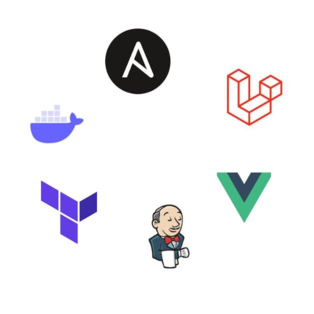
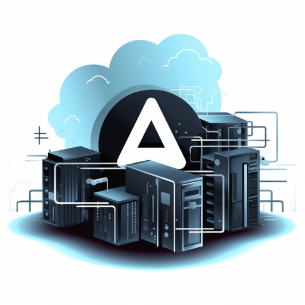
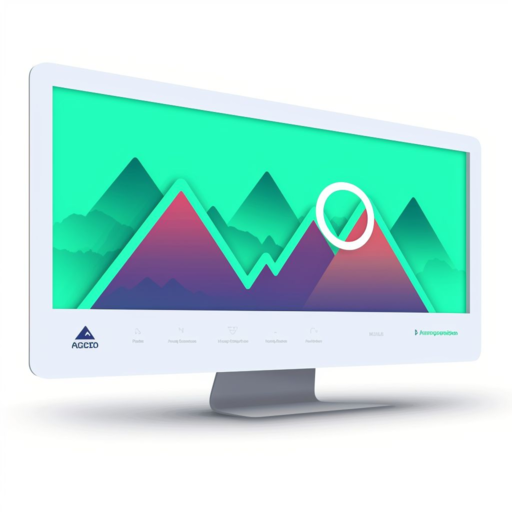
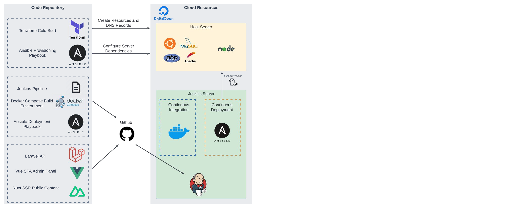

# THESTARTER.NET  
## Starter Architecture

Solution for a scalable and maintainable web application ecosystem  
created by **thestarter.net**

---

## Architecture at a Glance

### Architecture Overview

**Key Points**:
- *Containerization* using Docker Compose to ensure a consistent, isolated development environment, reducing setup complexities.
- *Infrastructure management* with Terraform, *Server provisioning* with Ansible, and *release engineering* through Jenkins and Docker.
- The web application comprises **Laravel** for back-end API development, along with **Vue.js/Nuxt** for front-end single-page (SPA) and server-side rendering (SSR) applications.

---

## Key Technologies

### Technologies Used

**Key Points**:
- **Terraform** – Infrastructure as Code  
- **Ansible** – Configuration Management  
- **Docker** – Containerization  
- **Docker Compose** – Development Environment  
- **Jenkins** – Release Engineering  
- **Laravel** – Back-end API  
- **Vue.js** – Front-end SPA for Admin Panel  
- **Nuxt** – Front-end SSR for Public Content  

---

## Terraform: Orchestrating Infrastructure

### Infrastructure as Code

**Key Points**:
- Automate the provisioning and management of infrastructure resources  
- Consistency across all environments; version control and reproducibility  
- Cost control, collaboration, and security: Infrastructure configurations can be defined and audited for security best practices

---

## Ansible: Configuration Management

### Server Provisioning

**Key Points**:
- Automates server setup and application deployment  
- Ansible playbooks are *idempotent*, meaning you can run them multiple times without causing unintended changes  
- Ansible allows you to define and enforce security policies and compliance standards across your infrastructure  

---

## Docker: Streamlining Development

### Containerization with Docker

**Key Points**:
- Packaging applications into containers offers consistency, isolation, and version control  
- Facilitating consistent runtime environments for the development environment and pipeline builds  
- Enhancing portability and scalability  

---

## CI/CD with Jenkins

### Continuous Integration and Deployment

**Key Points**:
- Automating and monitoring builds using Docker Compose environment and deployments using Ansible playbooks  
- Docker Compose’s containerization allows for portability, isolation, and scalability  
- Ansible playbooks can enforce security configurations and policies, and they also offer rollback capability in case of issues or failure  

---

## Laravel: Robust Backend API

### Backend API

**Key Points**:
- Laravel offers a robust and feature-rich framework for building efficient and scalable backend APIs  
- Domain-Driven Design architecture, separating the *Business Logic Layer (Services)* from the *Data Access Layer (Repositories)*  
- Microservices-ready: Each entity within our Laravel backend resides in a separate folder with its Provider, Routes, Requests, Controllers, Services, Repositories, and Models

---

## Vue.js Admin Panel and Nuxt Public Content

### Frontend SPA/SSR

**Key Points**:
- Separation between administrative tasks and public-facing content delivery, ensuring a responsive and SEO-friendly web application  
- Using Composition API syntax and TypeScript in Vue.js for more maintainable, readable, and type-safe code  
- Following the **7-1 Pattern** for organizing the SASS codebase

---

## Architecture Diagram

---

## References

- **Technology Practices Manual**:
  [Technology Practices Manual](./TechnologyGuide.md)

- **GitHub Repository**:  
  [https://github.com/NikolovskiRatko/starter-architecture](https://github.com/NikolovskiRatko/starter-architecture)

  *(Follow the README.md files for detailed usage instructions.)*

- **Usage Demonstration Video**:  
  [Usage Demonstration](https://www.youtube.com/watch?v=-ObfNN_rsPM)

- **Engineering Best Practices**:
  [Engineering Best Practices](./EngineeringBestPractices.md)